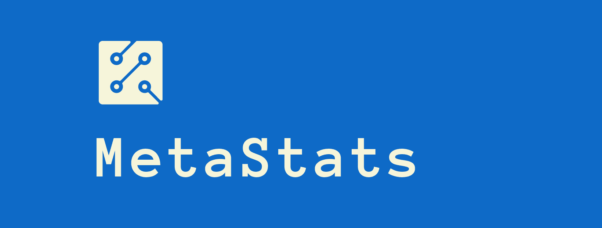

# MetaStats - Facebook Statistics
## _Progetto di Programmazione ad Oggetti 2021-2022_
#### Applicazione Java che effettua statistiche sulle location dei post di un utente Facebook.
    

# Contenuti
* Introduzione
* Installazione
* Configurazione
* Rotte
* Parametri
* Eccezioni
* Test
* Documentazione
* Autori 
